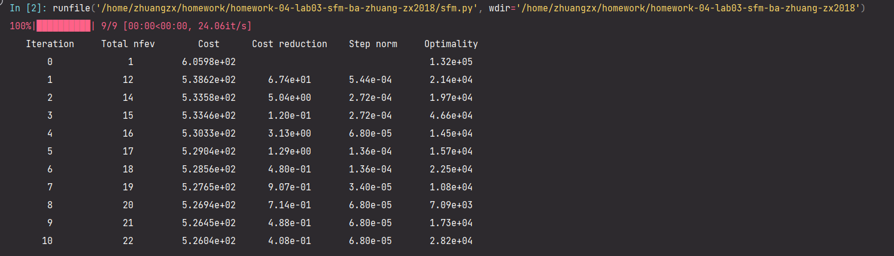

# CS4277/CS5477: Structure from Motion and Bundle Adjustment

---

## SFM和stereo作业  

### 0.数据集：mini-temple

<div align="left">
  
</div>


### 1.作业如表：  

|            | 目录                                        | 完成内容                 | 时间       |
| ---------- | ------------------------------------------- | ------------------------ | ---------- |
| *文字作业* | None                                        |                          |            |
| *编程作业* | ./sfm.py                                    | 完成了sfm,没训练完       | 2024.11.15 |
|            | ./preprocess.py<br />./bundle_adjustment.py | 完成了preprocess<br />bd | 2024.11.15 |

---


## Setting Up

If you are using Anaconda, you can run the following lines to setup:
```bash
conda create -n sfm python==3.7.6
conda activate sfm
pip  install -r requirements.txt
```

## Running Scripts
To run the scripts:
```bash
python preprocess.py --dataset temple  # performs preprocessing for temple dataset
python preprocess.py --dataset mini-temple  # performs preprocessing for mini-temple dataset
python sfm.py --dataset temple # performs structure from motion without bundle adjustment 
python sfm.py --dataset mini-temple --ba # performs structure from motion with bundle adjustment on mini-temple dataset
python sfm.py --dataset mini-temple # performs structure from motion without bundle adjustment on mini-temple dataset
```

To visualize, run:
```bash
python visualize.py --dataset mini-temple  # visualize 3d point cloud from reconstruction.
```
